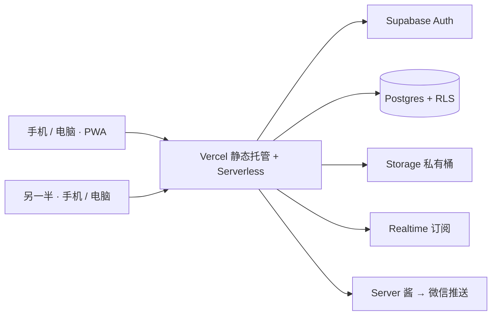
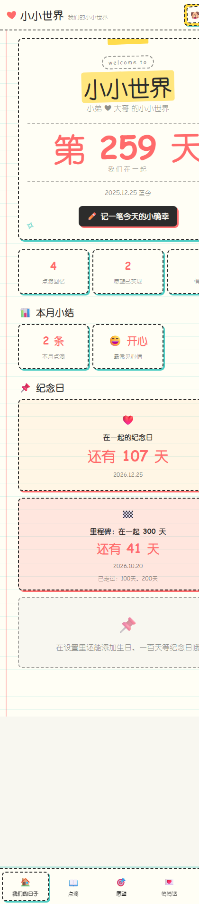
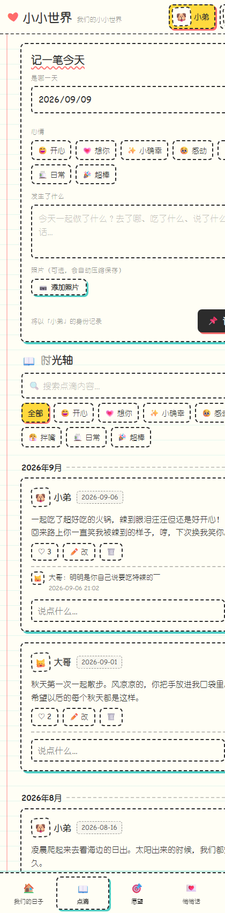
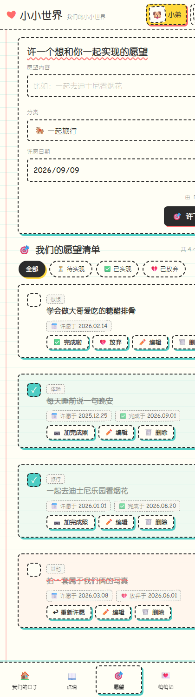
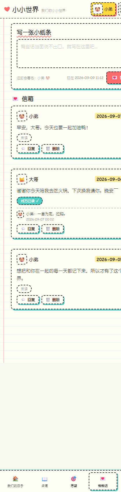
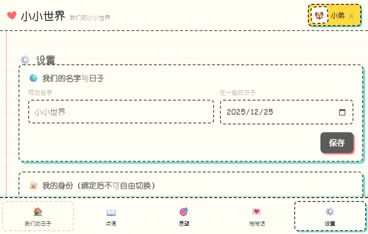
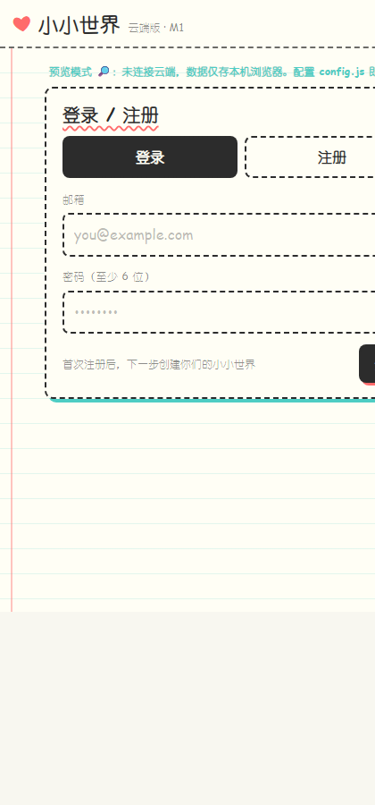

# 小小世界 · Our Little World

> 两个人的私密数字回忆本 —— 记录在一起的日子、生活点滴、共同愿望与想对彼此说的话。
> A private memory space for couples: days together, daily moments, shared wishes and secret notes.

<p>
  
  
  
  
</p>

- 线上地址：https://the-little-world-couple-diary.vercel.app/
- 设计语言：手绘涂鸦风（奶白纸 + 标记笔配色 + 虚线边框 + 硬边偏移阴影）

---

## 功能特性

**记录生活**
- 首页：在一起第 X 天、下一个纪念日倒计时、里程碑（100 天 / 200 天…）
- 点滴时光轴：文字 + 心情 + 多图（自动压缩）、点赞、评论、搜索与筛选
- 愿望清单：许愿日期、完成日期、已放弃；完成可附照片
- 悄悄话：精确到分的时间戳、回复、真正「看到」才标记已读

**双人协作**
- 邮箱注册 / 登录，邀请码绑定，一个空间最多 2 人
- 数据实时同步：一方保存，另一方 1–2 秒内自动更新
- 身份分配（大哥 / 小弟）可在设置中交换

**TA 的小本本（特色模块）**
- 私下记录关于对方的细节（口味 / 想要 / 雷区 / 作息…）
- 三档可见性收敛为「可申请查看 / 直接给 TA 看」，默认不暴露任何存在痕迹
- 对方按条目申请 → 我逐条勾选 + 设置有效期（7 天 / 30 天 / 永久）→ 可随时撤销
- 被记录者只能添加补充说明，不能修改原文；支持申请删除

**隐私与安全**
- Supabase Row Level Security：非空间成员在数据库层就读不到数据（前端隐藏不算安全）
- 照片存私有存储桶，前端通过 1 小时有效的签名 URL 访问
- 完全私密：没有邀请码 / 不在空间内 = 看不到、进不来

**提醒与备份**
- 站内：底部导航红点 + 顶部提醒条（查看或关闭即视为已读，每条只提醒一次）
- 微信推送（Server 酱 + Vercel Serverless Function）：新点滴 / 新愿望 / 悄悄话 / 申请与审批 / 补充说明 / 纪念日 30·7·3·1·0 天
- 支持双人各自的推送 Key；一键导出 / 导入备份（含「TA 的小本本」全部数据）

---

## 技术架构



| 层 | 选型 | 说明 |
|---|---|---|
| 前端 | 原生 HTML / CSS / JavaScript | 无框架、无构建步骤，一套代码同时跑通单机原型与云端版 |
| 设计系统 | 自研 CSS Token（手绘涂鸦风） | 虚线边框、硬边偏移阴影、微妙旋转、笔记本横线 |
| 账号 | Supabase Auth | 邮箱注册登录，邀请码绑定，空间上限 2 人 |
| 数据 | Supabase Postgres + RLS | 行级权限兜底，非成员查询返回空 |
| 图片 | Supabase Storage（私有桶） | 路径首段为 space_id，策略校验空间成员 |
| 同步 | Supabase Realtime | 空间数据变更推送，前端做差异对比后局部刷新 |
| 部署 | Vercel + Serverless Function | 静态托管 + /api/notify 转发微信推送 |
| 移动端 | PWA | manifest + Service Worker（网络优先，自动更新） |

---

## 核心实现亮点

1. **数据库层安全**：所有业务表开启 RLS，成员校验写入策略与 RPC，前端无法越权读取
2. **私有图片链路**：照片上传到私有桶，读取时签发短时效 URL，删除 / 替换同步清理存储对象
3. **实时同步 + 差异通知**：订阅 Postgres 变更，对比新旧数据得出「对方新增了什么」，只推送真正的新内容
4. **已读语义**：悄悄话用 IntersectionObserver 判断是否真正滚动可见，避免「后台挂着就变已读」
5. **通知去重**：站内提醒按条目 ID 记录已读，查看或关闭即消除红点，同一条不再重复打扰
6. **一键备份**：整份数据 + 小本本关系数据导出为单个 JSON，可跨设备导入还原
7. **PWA 更新策略**：Service Worker 网络优先 + 新版本接管后自动重载，规避长期缓存旧代码

---

## 界面截图

| 首页 | 点滴时光轴 |
|---|---|
|  |  |

| 愿望清单 | 悄悄话 |
|---|---|
|  |  |

| 设置 | 云端登录 |
|---|---|
|  |  |

---

## 本地运行

```bash
# 方式一：直接双击 index.html（单机原型，数据存浏览器）
# 方式二：启动本地静态服务
node start-server.js        # 然后访问 http://localhost:8080
```

云端版入口：`http://localhost:8080/cloud/index.html`（登录 / 绑定）与 `/cloud/app.html`（完整版）

## 连接云端（Supabase）

1. 新建 Supabase 项目，依次执行 `cloud/` 下的建表脚本：
   `schema.sql` → `schema-m1-fix.sql` → `schema-space-ops.sql` → `schema-m2.sql` → `schema-blob.sql` → `schema-m3.sql` → `schema-m4.sql` → `schema-partner-notes.sql` → `schema-notebook-backup.sql`
2. 复制 `cloud/config.example.js` 为 `cloud/config.js`，填入项目 URL 与 Publishable key
3. 部署到 Vercel（Application Preset 选 Other），详见 `部署指南.md`

---

## 项目结构

```
.
├── index.html / styles.css / js/       # 单机原型（本地版）
├── cloud/                              # 云端版
│   ├── index.html                      # 登录 / 邀请码绑定
│   ├── app.html                        # 完整版入口（复用同一套界面）
│   ├── cloud-store.js                  # 云端数据层（同步 / 照片 / 通知）
│   ├── partner-notes.js                #「TA 的小本本」模块
│   └── schema-*.sql                    # 数据库建表与函数
├── api/notify.js                       # Vercel Serverless：微信推送转发
├── manifest.json / sw.js / icon-*.png  # PWA
└── docs/                               # 文档与截图
```

## 文档索引

| 文档 | 内容 |
|---|---|
| `PRD.md` | 产品定位、功能模块、视觉规范 |
| `需求清单.md` | 按优先级排列的需求与完成状态 |
| `云版技术方案.md` | 云端架构、数据模型、里程碑与踩坑记录 |
| `部署指南.md` | Supabase + Vercel 部署步骤 |
| `TA的小本本-功能设计.md` |「TA 的小本本」功能设计与权限模型 |
| `给对方的使用指南.md` | 可直接发给另一半的上手说明 |

## 说明

个人自用项目，代码与设计仅授权本人及伴侣使用，未授权第三方商用或二次发布。
